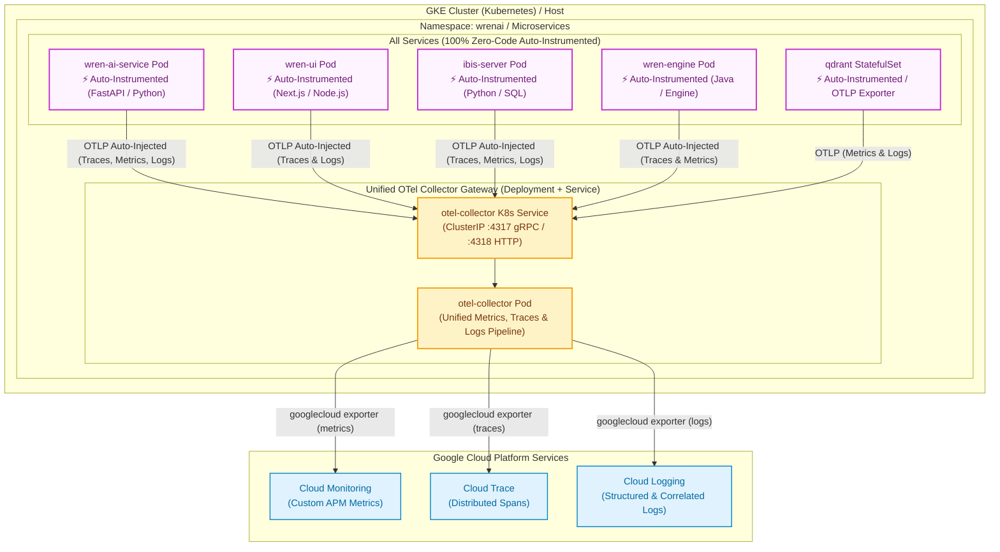

# Vanilla FastAPI OpenTelemetry Demo (GCE Ops Agent Integration)

This directory contains standalone **Vanilla FastAPI Applications** (Manual SDK + Zero-Code Auto-Instrumentation) configured to export metrics, traces, and logs directly to the **Google Cloud Ops Agent** running natively on a **Google Compute Engine (GCE) VM**.

---

## Architecture Topology



---

## 1. GCE VM Setup: Enable OTLP in Google Cloud Ops Agent

On your GCE VM, ensure the Google Cloud Ops Agent is installed and configure it to accept OTLP data:

1. **Install Ops Agent (if not already installed)**:
   ```bash
   curl -sSO https://dl.google.com/cloudagents/add-google-cloud-ops-agent-repo.sh
   sudo bash add-google-cloud-ops-agent-repo.sh --also-install
   ```

2. **Apply OTLP Configuration**:
   Copy the provided `ops-agent-config.yaml` to the Ops Agent configuration directory:
   ```bash
   sudo cp ops-agent-config.yaml /etc/google-cloud-ops-agent/config.yaml
   ```

3. **Restart the Ops Agent**:
   ```bash
   sudo systemctl restart google-cloud-ops-agent
   sudo systemctl status google-cloud-ops-agent
   ```
   *The Ops Agent is now listening on `0.0.0.0:4317` (gRPC) and `0.0.0.0:4318` (HTTP).*

---

## 2. Running the FastAPI Applications

### Option A: Via Docker Compose

```bash
docker compose up --build -d
```
*Port mappings:*
- Manual Instrumentation App: `http://localhost:8080`
- Zero-Code Instrumentation App: `http://localhost:8081`

### Option B: Directly on the VM (Python virtual environment)

```bash
# 1. Manual App
pip install -r requirements.txt
uvicorn main:app --host 0.0.0.0 --port 8000

# 2. Zero-Code App
cd zero-code-app
pip install -r requirements.txt
opentelemetry-bootstrap -a install
OTEL_SERVICE_NAME=zero-code-fastapi-service \
OTEL_EXPORTER_OTLP_ENDPOINT=http://localhost:4317 \
opentelemetry-instrument uvicorn main:app --host 0.0.0.0 --port 8001
```

---

## 3. Verifying Telemetry in GCP Console

1. **Cloud Monitoring (Metrics)**:
   - Navigate to **GCP Console $\rightarrow$ Cloud Monitoring $\rightarrow$ Metrics Explorer**.
   - Search for metric: `workload.googleapis.com/vanilla_api_actions_total` or `workload.googleapis.com/vanilla_button_clicks_total`.
   - Filter / Group by `service.name = "vanilla-fastapi-service"`.

2. **Cloud Trace (Waterfall Spans)**:
   - Navigate to **GCP Console $\rightarrow$ Cloud Trace $\rightarrow$ Trace Explorer**.
   - Filter by Service: `vanilla-fastapi-service` or `zero-code-fastapi-service`.
